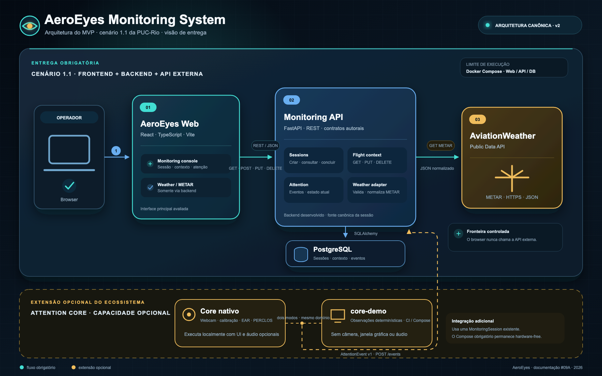

# AeroEyes Web

[Português](README.md) · [English](README.en.md)

Interface Web do **AeroEyes Monitoring System**, construída com React,
TypeScript e Vite. Este repositório é a porta de entrada da entrega do MVP e
contém também o Docker Compose reproduzível do sistema.

## Enquadramento da entrega PUC-Rio

O MVP segue o **cenário 1.1** do guia da Sprint 3:

```text
AeroEyes Web → Monitoring API → AviationWeather Data API
                            ↘ PostgreSQL
```

- **Frontend desenvolvido:** AeroEyes Web.
- **Backend desenvolvido:** AeroEyes Monitoring API.
- **API pública externa:** AviationWeather.gov Data API, consumida pelo backend.
- **Persistência:** PostgreSQL.
- **Extensão opcional:** Attention Core nativo e `core-demo` determinístico.

O Attention Core amplia o ecossistema com câmera, calibração e classificação de
atenção, mas não é necessário para demonstrar o limite mínimo do cenário 1.1.

[](docs/architecture/aeroeyes-mvp-architecture.svg)

_Arquitetura canônica do MVP: entrega obrigatória do cenário 1.1 e Attention
Core identificado separadamente como extensão opcional. Clique na imagem para
abrir a versão vetorial._

Consulte a [matriz de evidências da rubrica](docs/delivery/puc-rubric-evidence.md)
para relacionar cada requisito da PUC ao código e à demonstração. O desenho
também está disponível como [SVG editável](docs/architecture/aeroeyes-mvp-architecture.svg)
e como [fonte Mermaid](docs/architecture/aeroeyes-mvp-architecture.mmd).

## Repositórios da entrega

| Componente | Responsabilidade | Repositório |
| --- | --- | --- |
| AeroEyes Web | Interface HTML/CSS/JavaScript e composição Docker | [piglesiastecnologia/aeroeyes-web](https://github.com/piglesiastecnologia/aeroeyes-web) |
| Monitoring API | API REST, integração externa e persistência | [piglesiastecnologia/aeroeyes-monitoring-api](https://github.com/piglesiastecnologia/aeroeyes-monitoring-api) |
| Attention Core | Extensão privada e opcional para captura e análise local | Documentado separadamente; não compõe o mínimo do cenário 1.1 |

## Funcionalidades demonstradas

- criação, restauração e conclusão de uma sessão de monitoramento;
- inclusão, substituição e remoção de contexto de voo;
- consulta de METAR de origem e destino por meio da Monitoring API;
- leitura do estado de atenção e da janela recente de eventos, quando
  produzidos pela extensão Attention Core;
- estados honestos para indisponibilidade da API, ausência de contexto e
  telemetria ainda não recebida.

O navegador usa `GET`, `POST`, `PUT` e `DELETE`. Ele nunca chama
AviationWeather.gov diretamente: a Monitoring API valida, normaliza e devolve
o contrato usado pela interface.
 
## Execução reproduzível com Docker Compose

O caminho principal do MVP inicia PostgreSQL, aplica as migrações da API,
inicia a Monitoring API e serve o build de produção do Web em
`http://localhost:18080`.

Mantenha `aeroeyes-web` e `aeroeyes-monitoring-api` como diretórios irmãos.
Depois, neste repositório:

```sh
cp compose.env.example compose.env.aeroeyes
docker compose --env-file compose.env.aeroeyes up --build -d
docker compose --env-file compose.env.aeroeyes ps
```

Quando API e Web estiverem saudáveis, abra `http://localhost:18080`. Para
encerrar preservando o volume local:

```sh
docker compose --env-file compose.env.aeroeyes down
```

Use `down -v` somente quando quiser remover também os dados locais.

### Demonstração opcional do Attention Core

Se o repositório privado `aeroeyes-poc` também estiver presente como irmão, o
perfil opcional `core-demo` publica eventos determinísticos em uma sessão já
criada, sem câmera, janela gráfica, relógio real de teste ou hardware de áudio:

```sh
docker compose --env-file compose.env.aeroeyes run --rm \
  -e AEROEYES_MONITORING_SESSION_ID=<session-id> \
  core-demo
```

O Core nativo com webcam é uma demonstração separada e local. O navegador não
controla a câmera, e o container principal da banca não depende dela.

## Execução local do frontend

Requisitos:

- Node.js 22.15 ou compatível;
- Monitoring API em execução.

Copie `.env.example` para `.env.local` e configure a URL da API:

```dotenv
VITE_MONITORING_API_URL=http://127.0.0.1:8000
```

Instale as dependências e inicie o frontend:

```sh
npm ci
npm run dev
```

A aplicação fica disponível em `http://localhost:5173`.


## Contratos HTTP exercitados pela interface

| Método | Rota | Ação |
| --- | --- | --- |
| `GET` | `/health` | Verificar disponibilidade da API |
| `POST` | `/sessions` | Iniciar monitoramento |
| `GET` | `/sessions/{session_id}` | Restaurar a sessão canônica |
| `POST` | `/sessions/{session_id}/complete` | Concluir a sessão |
| `GET` | `/sessions/{session_id}/context` | Carregar contexto de voo |
| `PUT` | `/sessions/{session_id}/context` | Salvar ou substituir contexto |
| `DELETE` | `/sessions/{session_id}/context` | Remover contexto |
| `GET` | `/sessions/{session_id}/weather` | Consultar METAR normalizado |
| `GET` | `/sessions/{session_id}/attention-state` | Consultar último estado de atenção |
| `GET` | `/sessions/{session_id}/events?limit=10` | Consultar eventos recentes |

## Validação

```sh
npm run lint
npm run build
```

O workflow de CI valida o frontend, a imagem de container e o smoke test
determinístico da composição Web/API/PostgreSQL. A demonstração opcional do
Attention Core é complementar e não altera o caminho principal de execução.

## Limites declarados

- O sistema é um MVP acadêmico e experimental; não é um produto aeronáutico ou
  médico certificado.
- METAR é contexto operacional atual, não entrada para a classificação de
  atenção.
- A rota de clima não mantém histórico nem cache no MVP.
- Eventos de atenção representam transições semânticas, não vídeo ou
  telemetria biométrica contínua.
