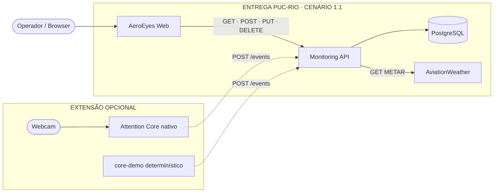

# Diagramas de arquitetura do AeroEyes

Esta pasta mantém duas representações da mesma arquitetura canônica:

- `aeroeyes-mvp-architecture.svg`: versão visual refinada e editável;
- `aeroeyes-mvp-architecture.png`: exportação estável usada no README e na apresentação;
- `aeroeyes-mvp-architecture.mmd`: fonte Mermaid compacta, renderizada diretamente pelo GitHub.

O SVG/PNG é o artefato principal da banca porque oferece controle preciso de
hierarquia, identidade visual e legibilidade. O Mermaid é complementar: torna
o fluxo fácil de revisar em diff e simples de atualizar quando um contrato ou
componente mudar.

## Versão Mermaid

O diagrama não representa gateway, mensageria, cache, réplica, autenticação ou
observabilidade porque esses componentes não pertencem ao MVP implementado.
